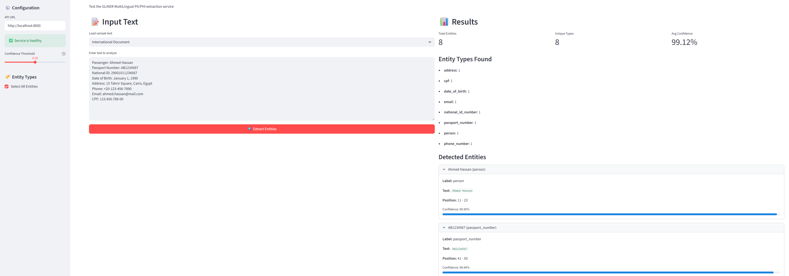

# GLiNER MultiLingual PII/PHI Extraction Service

A FastAPI service for extracting Personally Identifiable Information (PII) and Protected Health Information (PHI) from text using the [GLiNER Multi-PII Model](https://huggingface.co/urchade/gliner_multi_pii-v1).

## Features

- 🌍 **Multilingual Support** - English, French, German, Spanish, Portuguese  and Italian
- 🔍 **50+ Entity Types** - Person, email, phone, SSN, address, medical conditions, etc.
- ⚡ **Fast API** - RESTful endpoints with automatic documentation
- 🎨 **Streamlit UI** - UI to test entity detection and adjust confidence levels for testing 
- 🖥️ **Cross-Platform** - Setup works on Windows, Linux, and macOS

## Supported Entity Types

| Category | Entity Types |
|----------|-------------|
| **Personal** | person, date_of_birth |
| **Contact** | email, phone_number, mobile_phone_number, fax_number, address |
| **Financial** | credit_card_number, credit_card_cvv, bank_account_number, iban, transaction_number |
| **Government IDs** | social_security_number, passport_number, driver_license_number, tax_identification_number, national_id_number, identity_card_number, cpf |
| **Medical** | medical_condition, medication, health_insurance_id_number, medical_record_number |
| **Travel** | flight_number, passport_expiration_date, vehicle_registration_number, license_plate_number |
| **Digital** | email_address, ip_address, username, password, social_media_handle, digital_signature |
| **Other** | organization, insurance_number, student_id_number, security_code, landline_phone_number |

## Quick Start

<details>
<summary><strong>Step 1: Setup</strong></summary>

<summary><strong>Clone the Repo</strong></summary>

```bash
git clone <repository-url> GLiNER_MultiLingual_PII_PHI
cd GLiNER_MultiLingual_PII_PHI
```
<summary><strong>Install uv (if not installed)</strong></summary>

**Windows (PowerShell):**
```powershell
pip install uv
```

**Linux/macOS:**
```bash
curl -LsSf https://astral.sh/uv/install.sh | sh
```

Or with pip:
```bash
pip install uv
```
<summary><strong>Create Virtual Environment</strong></summary>

**Windows:**
```powershell
uv venv
.venv\Scripts\activate
```

**Linux/macOS:**
```bash
uv venv
source .venv/bin/activate
```
<summary><strong>Install Dependencies</strong></summary>

```bash
uv pip install -r requirements.txt
```
<summary><strong>📁 Project Structure</strong></summary>

```
GLiNER_MultiLingual_PII_PHI/
├── src/
│   ├── main_service.py          # FastAPI service
│   └── streamlit_app.py         # Streamlit web UI for testing
├── data/
│   ├── data_gen.py              # Dataset generation script
│   ├── medical_phi_dataset.json # Medical PHI evaluation data
│   ├── mixed_language_dataset.json # Multilingual evaluation data
│   ├── ner_evaluation_dataset.json # NER evaluation dataset
│   ├── structured_pii_phi.csv   # Structured CSV evaluation data
│   └── travel_pii_dataset.json  # Travel PII evaluation data
├── evals/
│   ├── evaluation.py            # Evaluation script
│   ├── evaluation_service.py    # NER evaluation service
│   └── evaluation_report.json   # Generated evaluation report
├── tests/
│   └── test_extraction.py       # Pytest test cases
├── screenshots/                 # UI screenshots
├── requirements.txt             # Python dependencies
├── README.md                    # This file
└── .venv/                       # Virtual environment
```
</details>

<details>
<summary><strong>Step 2: Service Details and Testing</strong></summary>

<summary><strong>Start the Service</strong></summary>
```bash
python src/main_service.py
```

Or with uvicorn directly:

```bash
cd src && uvicorn main_service:app --host 127.0.0.1 --port 8000 --reload
```

You should see:

```
INFO:     Loading GLiNER PII model...
INFO:     Model loaded successfully
INFO:     Uvicorn running on http://127.0.0.1:8000
INFO:     Application startup complete.
```
<summary><strong>Test the Service</strong></summary>

**Option A: Open API Docs in Browser**

http://127.0.0.1:8000/docs

**Option B: Test with curl (Linux/macOS/Windows)**

```bash
# Health check
curl http://127.0.0.1:8000/health

# Extract PII
curl -X POST "http://127.0.0.1:8000/extract" \
  -H "Content-Type: application/json" \
  -d '{"text":"John Smith email is john@test.com and phone is 555-123-4567"}'
```

**Option C: Test with PowerShell (Windows)**

```powershell
# Health check
Invoke-RestMethod -Uri "http://127.0.0.1:8000/health"

# Extract PII
$body = '{"text":"John Smith email is john@test.com and phone is 555-123-4567"}'
Invoke-RestMethod -Uri "http://127.0.0.1:8000/extract" -Method Post -Body $body -ContentType "application/json"
```

**Option D: Streamlit Web UI**

For an interactive web interface, run the Streamlit app:

```bash
# Make sure the FastAPI service is running first, then:
python -m streamlit run src/streamlit_app.py
```

Open http://localhost:8501 in your browser.

<summary><strong>🔌 API Endpoints</strong></summary>

| Method | Endpoint | Description |
|--------|----------|-------------|
| GET | `/` | API info |
| GET | `/health` | Health check |
| GET | `/entities` | List supported entity types |
| GET | `/docs` | Swagger UI documentation |
| POST | `/extract` | Extract PII entities from text |

</details>

<details>
<summary><strong>Step 3: API Details & Example Request/Response</strong></summary>

**Request:**

```json
{
  "text": "Contact John Smith at john.smith@email.com or call 555-123-4567",
  "threshold": 0.5
}
```

**Response:**

```json
{
  "entities": [
    {"text": "John Smith", "label": "person", "start": 8, "end": 18, "score": 0.98},
    {"text": "john.smith@email.com", "label": "email", "start": 22, "end": 42, "score": 0.99},
    {"text": "555-123-4567", "label": "phone number", "start": 51, "end": 63, "score": 0.96}
  ],
  "text": "Contact John Smith at john.smith@email.com or call 555-123-4567",
  "entity_count": 3,
  "entity_types": {"person": 1, "email": 1, "phone number": 1}
}
```
<summary><strong>🤖 Model Information</strong></summary>

- **Model**: [urchade/gliner_multi_pii-v1](https://huggingface.co/urchade/gliner_multi_pii-v1)
- **Size**: ~1.16 GB
- **Base Model**: microsoft/mdeberta-v3-base

**Cache Location:**

| OS | Path |
|----|------|
| Windows | `C:\Users\<username>\.cache\huggingface\hub\models--urchade--gliner_multi_pii-v1` |
| Linux | `~/.cache/huggingface/hub/models--urchade--gliner_multi_pii-v1` |
| macOS | `~/.cache/huggingface/hub/models--urchade--gliner_multi_pii-v1` |
<summary><strong>🔧 Troubleshooting</strong></summary>

| Issue | Solution |
|-------|----------|
| `Model not loaded` | Wait for startup to complete or check disk space |
| `Connection refused` | Ensure service is running on port 8000 |
| `Import error` | Run `uv pip install -r requirements.txt` |
| `CUDA out of memory` | Model runs on CPU by default |
| `Permission denied (Linux)` | Run `chmod +x` or check file permissions |
| `uv not found` | Restart terminal after installing uv |
<summary><strong>⚙️ Environment Variables (Optional)</strong></summary>

```bash
# Set custom Hugging Face cache directory
export HF_HOME=/path/to/cache  # Linux/macOS
set HF_HOME=C:\path\to\cache   # Windows

# Disable symlinks (Windows - fixes download errors)
set HF_HUB_DISABLE_SYMLINKS_WARNING=1
```
<summary><strong>🐳 Docker (Optional)</strong></summary>

```dockerfile
FROM python:3.11-slim

WORKDIR /app
COPY requirements.txt .
RUN pip install uv && uv pip install --system -r requirements.txt

COPY main_service.py .
EXPOSE 8000

CMD ["uvicorn", "main_service:app", "--host", "0.0.0.0", "--port", "8000"]
```

Build and run:

```bash
docker build -t gliner-pii .
docker run -p 8000:8000 gliner-pii
```
</details>

<details>
<summary><strong>Step 4: Run Tests</strong></summary>

```bash
# Activate virtual environment
# Windows:
.venv\Scripts\activate
# Linux/macOS:
source .venv/bin/activate

# Run all tests
python -m pytest tests/test_extraction.py -v

# Run specific test class
python -m pytest tests/test_extraction.py::TestPersonExtraction -v

# Run multilingual tests
python -m pytest tests/test_extraction.py::TestMultilingualParagraphs -v

# Run with short traceback
python -m pytest tests/test_extraction.py -v --tb=short
```

</details>
<details>
<summary><strong>Step 5: Start Streamlit UI</strong></summary>

The Streamlit app provides an interactive interface for testing the PII extraction service:

#### Features

- **Service Health Check** - Real-time connection status to the FastAPI backend
- **Configurable Threshold** - Slider to adjust detection sensitivity (0.0-1.0)
- **Entity Type Selection** - Choose specific PII/PHI types or select all
- **Sample Texts** - Pre-loaded examples (Medical Record, Financial Document, Business Contact, International Document)
- **Results Display** - Summary metrics, entity breakdown, and detailed entity list with confidence scores
- **Highlighted Text View** - Visual color-coded highlighting of detected entities
- **Raw JSON Output** - Expandable section with the full API response

#### Running the Streamlit App

**Windows:**
```powershell
# Terminal 1: Start FastAPI service
python src/main_service.py

# Terminal 2: Start Streamlit app
python -m streamlit run src/streamlit_app.py
```

**Linux/macOS:**
```bash
# Terminal 1: Start FastAPI service
source .venv/bin/activate
python src/main_service.py

# Terminal 2: Start Streamlit app
source .venv/bin/activate
python -m streamlit run src/streamlit_app.py
```

#### Screenshot




The UI includes:
- Left panel: Input text area with sample text selector
- Right panel: Extraction results with entity details
- Bottom: Highlighted text with color-coded entities and legend

</details>

## Evaluations

### Performance by Language

NER evaluation dataset (360 samples) shows strong multilingual performance:

| Language | Samples | Positive | Negative | Precision | Recall | F1 Score |
|----------|---------|----------|----------|-----------|--------|----------|
| Portuguese | 60 | 50 | 10 | 0.8934 | 0.9412 | **0.9167** |
| French | 60 | 50 | 10 | 0.8687 | 0.9503 | **0.9077** |
| Spanish | 60 | 50 | 10 | 0.8643 | 0.9451 | **0.9029** |
| English | 60 | 50 | 10 | 0.8713 | 0.9263 | **0.8980** |
| Italian | 60 | 50 | 10 | 0.8416 | 0.9444 | **0.8901** |
| German | 60 | 50 | 10 | 0.8173 | 0.8994 | **0.8564** |

**Overall:** Precision: 0.8594 | Recall: 0.9345 | F1 Score: **0.8954**

### Running Evaluation

```bash
# Run the main evaluation script
python evals/evaluation.py

# Run the NER evaluation service with detailed report
python evals/evaluation_service.py --dataset data/ner_evaluation_dataset.json --output evals/evaluation_report.json --verbose
```

<details>
<summary><strong> Evals Results & Data Generation Tool</strong></summary>

This project includes tool to generate synthetic test dataset.

#### Data Generation (`data_gen.py`)

Generate synthetic multilingual NER datasets for testing PII/PHI extraction.

**Features:**
- **30 template variations** per language for diverse sentence structures
- **50 positive samples** per language (sentences with PII entities)
- **10 negative samples** per language (clean sentences without PII)
- **30 entity types** with realistic synthetic data
- **Automatic position tracking** for entity spans

**Usage:**
```bash
python data/data_gen.py
```

**Output:** `ner_evaluation_dataset.json` with 360 samples (300 positive, 60 negative)

**Dataset Format:**
```json
{
  "language": "English",
  "text": "Patient John Doe, born 15/03/1985, diagnosed with Diabetes Type 2...",
  "entities": [
    {"text": "John Doe", "label": "person", "start": 8, "end": 16},
    {"text": "15/03/1985", "label": "date_of_birth", "start": 23, "end": 33},
    {"text": "Diabetes Type 2", "label": "medical_condition", "start": 50, "end": 65}
  ]
}
```


| Dataset | Examples | Description |
|---------|----------|-------------|
| **Structured CSV** | 50 | Comma-separated PII/PHI records |
| **Medical PHI** | 60 | Clinical/healthcare scenarios (6 languages) |
| **NER Evaluation (Original)** | 360 | Multilingual baseline (300 positive, 60 negative) |
| **Mixed Language** | 51 | Code-switching multilingual text (2-6 languages per example) |
| **Travel PII** | 60 | Air/water/land travel with passport, driver's license, visa |

<summary><strong>1. Structured CSV (F1: 0.855) ✅ Best</strong></summary>

| Label | TP | FP | FN | Precision | Recall | F1 |
|-------|----|----|----|-----------| -------|-----|
| person | 50 | 0 | 0 | 1.000 | 1.000 | **1.000** |
| address | 50 | 0 | 0 | 1.000 | 1.000 | **1.000** |
| phone_number | 50 | 2 | 0 | 0.962 | 1.000 | **0.980** |
| email | 50 | 5 | 0 | 0.909 | 1.000 | **0.952** |
| date_of_birth | 43 | 0 | 7 | 1.000 | 0.860 | **0.925** |
| medical_condition | 47 | 9 | 3 | 0.839 | 0.940 | **0.887** |
| medication | 40 | 3 | 10 | 0.930 | 0.800 | **0.860** |
| national_id_number | 4 | 0 | 46 | 1.000 | 0.080 | **0.148** |

<summary><strong>2. Medical PHI (F1: 0.763)</strong></summary>

| Label | TP | FP | FN | Precision | Recall | F1 |
|-------|----|----|----|-----------| -------|-----|
| organization | 57 | 10 | 12 | 0.851 | 0.826 | **0.838** |
| location | 32 | 3 | 12 | 0.914 | 0.727 | **0.810** |
| person | 95 | 24 | 22 | 0.798 | 0.812 | **0.805** |
| date | 25 | 0 | 13 | 1.000 | 0.658 | **0.794** |
| medication | 16 | 5 | 4 | 0.762 | 0.800 | **0.780** |
| medical_condition | 36 | 21 | 16 | 0.632 | 0.692 | **0.661** |

<summary><strong>3. NER Evaluation - Original (F1: 0.709)</strong></summary>

| Label | TP | FP | FN | Precision | Recall | F1 |
|-------|----|----|----|-----------| -------|-----|
| medical_condition | 42 | 0 | 0 | 1.000 | 1.000 | **1.000** |
| medication | 42 | 0 | 0 | 1.000 | 1.000 | **1.000** |
| address | 54 | 1 | 0 | 0.982 | 1.000 | **0.991** |
| date_of_birth | 40 | 0 | 2 | 1.000 | 0.952 | **0.976** |
| transaction_number | 35 | 1 | 1 | 0.972 | 0.972 | **0.972** |
| passport_number | 40 | 2 | 2 | 0.952 | 0.952 | **0.952** |
| credit_card_number | 35 | 5 | 1 | 0.875 | 0.972 | **0.921** |
| fax_number | 36 | 7 | 0 | 0.837 | 1.000 | **0.911** |
| flight_number | 35 | 7 | 7 | 0.833 | 0.833 | **0.833** |
| person | 163 | 70 | 5 | 0.700 | 0.970 | **0.813** |
| bank_account_number | 17 | 7 | 1 | 0.708 | 0.944 | **0.810** |
| iban | 12 | 0 | 6 | 1.000 | 0.667 | **0.800** |
| mobile_phone_number | 31 | 0 | 17 | 1.000 | 0.646 | **0.785** |
| credit_card_cvv | 22 | 1 | 14 | 0.957 | 0.611 | **0.746** |
| social_security_number | 22 | 3 | 26 | 0.880 | 0.458 | **0.603** |
| national_id_number | 24 | 22 | 12 | 0.522 | 0.667 | **0.585** |
| organization | 51 | 80 | 9 | 0.389 | 0.850 | **0.534** |
| license_plate_number | 11 | 4 | 19 | 0.733 | 0.367 | **0.489** |
| vehicle_registration_number | 8 | 18 | 22 | 0.308 | 0.267 | **0.286** |
| student_id_number | 0 | 0 | 36 | 0.000 | 0.000 | **0.000** |

<summary><strong>4. Mixed Language (F1: 0.633)</strong></summary>

| Label | TP | FP | FN | Precision | Recall | F1 |
|-------|----|----|----|-----------| -------|-----|
| passport_number | 10 | 0 | 0 | 1.000 | 1.000 | **1.000** |
| medical_condition | 8 | 0 | 0 | 1.000 | 1.000 | **1.000** |
| tax_identification_number | 3 | 0 | 0 | 1.000 | 1.000 | **1.000** |
| driver_license_number | 2 | 0 | 0 | 1.000 | 1.000 | **1.000** |
| phone_number | 21 | 1 | 0 | 0.955 | 1.000 | **0.977** |
| email | 12 | 1 | 0 | 0.923 | 1.000 | **0.960** |
| organization | 11 | 0 | 1 | 1.000 | 0.917 | **0.957** |
| date_of_birth | 13 | 0 | 14 | 1.000 | 0.481 | **0.650** |
| transaction_number | 3 | 0 | 4 | 1.000 | 0.429 | **0.600** |
| flight_number | 5 | 3 | 4 | 0.625 | 0.556 | **0.588** |
| person | 31 | 23 | 23 | 0.574 | 0.574 | **0.574** |
| address | 11 | 0 | 18 | 1.000 | 0.379 | **0.550** |
| medication | 3 | 6 | 6 | 0.333 | 0.333 | **0.333** |
| credit_card_number | 2 | 5 | 5 | 0.286 | 0.286 | **0.286** |

<summary><strong>5. Travel PII (F1: 0.442)</strong></summary>

| Label | TP | FP | FN | Precision | Recall | F1 |
|-------|----|----|----|-----------| -------|-----|
| phone_number | 12 | 0 | 0 | 1.000 | 1.000 | **1.000** |
| mobile_phone_number | 6 | 0 | 0 | 1.000 | 1.000 | **1.000** |
| email | 7 | 0 | 0 | 1.000 | 1.000 | **1.000** |
| passport_expiration_date | 7 | 0 | 0 | 1.000 | 1.000 | **1.000** |
| insurance_number | 6 | 0 | 0 | 1.000 | 1.000 | **1.000** |
| credit_card_number | 11 | 2 | 0 | 0.846 | 1.000 | **0.917** |
| passport_number | 28 | 3 | 3 | 0.903 | 0.903 | **0.903** |
| driver_license_number | 13 | 3 | 6 | 0.812 | 0.684 | **0.743** |
| bank_account_number | 3 | 0 | 3 | 1.000 | 0.500 | **0.667** |
| person | 36 | 24 | 24 | 0.600 | 0.600 | **0.600** |
| organization | 18 | 14 | 15 | 0.562 | 0.545 | **0.554** |
| identity_card_number | 5 | 0 | 9 | 1.000 | 0.357 | **0.526** |
| vehicle_registration_number | 4 | 12 | 2 | 0.250 | 0.667 | **0.364** |
| flight_number | 5 | 13 | 7 | 0.278 | 0.417 | **0.333** |
| date_of_birth | 8 | 0 | 49 | 1.000 | 0.140 | **0.246** |
| address | 0 | 2 | 95 | 0.000 | 0.000 | **0.000** |
| transaction_number | 0 | 0 | 11 | 0.000 | 0.000 | **0.000** |

</details>

<details>
<summary><strong>📈 Entity Performance Across Datasets</strong></summary>

| Entity Type | Structured CSV | Medical PHI | NER Original | Mixed Lang | Travel PII |
|-------------|----------------|-------------|--------------|------------|------------|
| person | 1.000 | 0.805 | 0.813 | 0.574 | 0.600 |
| address | 1.000 | - | 0.991 | 0.550 | 0.000 |
| phone_number | 0.980 | - | - | 0.977 | 1.000 |
| email | 0.952 | - | - | 0.960 | 1.000 |
| passport_number | - | - | 0.952 | 1.000 | 0.903 |
| medical_condition | 0.887 | 0.661 | 1.000 | 1.000 | - |
| medication | 0.860 | 0.780 | 1.000 | 0.333 | - |

</details>

<details>
<summary><strong>✅ Best Performing Entity Types</strong></summary>

- ✅ `phone_number` / `email` - Highly reliable across all contexts
- ✅ `passport_number` - Strong performance (0.90+)
- ✅ `medical_condition` - Excellent in medical/structured contexts

</details>

<details>
<summary><strong>⚠️ Challenging Entity Types</strong></summary>

- ⚠️ `person` - Variable performance (0.57-1.00) depending on context
- ⚠️ `address` - Poor in travel context, excellent in structured data
- ❌ `student_id_number` - Not recognized by model
- ❌ `transaction_number` - Inconsistent across datasets

</details>

<details>
<summary><strong>🚨 Known Limitations</strong></summary>

1. **Organization over-detection**: Model tends to identify non-organization text as organizations
2. **Student ID not recognized**: Model doesn't support `student_id_number` label
3. **Address extraction in travel**: Struggles with complex international addresses
4. **ID format confusion**: Various national ID formats get misclassified

</details>

## License

MIT License

## References

- [GLiNER GitHub](https://github.com/urchade/GLiNER)
- [GLiNER Multi-PII Model](https://huggingface.co/urchade/gliner_multi_pii-v1)
- [FastAPI Documentation](https://fastapi.tiangolo.com/)
- [Streamlit Documentation](https://docs.streamlit.io/)
- [uv Documentation](https://github.com/astral-sh/uv)


